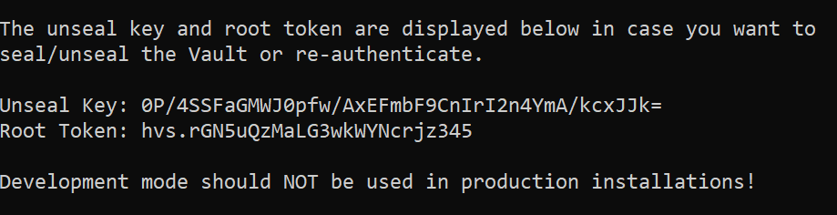

## Лабораторная работа №1 "Установка Docker и Minikube, мой первый манифест."

Для разворачивания сервиса Vault был создан namespace ```my-vault```:

```bash 
kubectl apply -f my-namespace.yaml
```

Был создан service-account и сluster-role-bindings, так как Vault требует дополнительные разрешения:

```bash 
kubectl apply -f rbac.yaml
```

Vault так же требует файл конфигурации с соответствующими параметрами для старта сервера:

```bash 
kubectl apply -f configmap.yaml
```

Далее был создан service для Vault с единственным портом ```8200```:

```bash 
kubectl apply -f services.yaml
```

После чего был создан файл для разворачивания пода, на котором будет находиться контейнер с Vault:

```bash 
kubectl apply -f deployment.yaml
```

Дальнейшее наблюдение можно делать через следующие команды:

```bash 
kubectl get po # Покажет все доступные поды в namespace
```

```bash 
minikube dashboard # Откроет дашборд в виде UI со всей актуальной информации по каждому namespace
```

```bash 
kubectl logs <pod-name> # Покажет все логи внутри указанного пода
```

Через логи был получен токен для авторизации в поднятом Vault:



Схема организации namespace:

