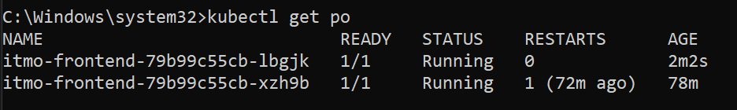

University: [ITMO University](https://itmo.ru/ru/)\
Faculty: [FICT](https://fict.itmo.ru)\
Course: [Introduction to distributed technologies](https://github.com/itmo-ict-faculty/introduction-to-distributed-technologies)\
Year: 2023/2024\
Group: K4110c\
Author: Ageev Andrey Evgenevich\
Lab: Lab 2\
Date of create: 10.09.2023\
Date of finished: 22.09.2023
## Лабораторная работа №2 "Развертывание веб сервиса в Minikube, доступ к веб интерфейсу сервиса. Мониторинг сервиса."

Для разворачивания сервиса itdt-contained-frontend был создан namespace ```itmo-frontend```:

```bash 
kubectl apply -f my-namespace.yaml
```

Был создан service-account:

```bash 
kubectl apply -f sa.yaml
```

Далее был создан service с типом NodePort с единственным портом ```3000```:

```bash 
kubectl apply -f services.yaml
```

После чего был создан файл для разворачивания пода, на котором будет находиться контейнер с itdt-contained-frontend:

```bash 
kubectl apply -f deployment.yaml
```

Дальнейшее наблюдение можно делать через следующие команды:

```bash 
kubectl get po # Покажет все доступные поды в namespace
```

```bash 
minikube dashboard # Откроет дашборд в виде UI со всей актуальной информации по каждому namespace
```

```bash 
kubectl logs <pod-name> # Покажет все логи внутри указанного пода
```

После разворачивания сервиса была получена следующая страница:


При написании ```deployment.yaml``` переменные окружения были указаны как:
* ```REACT_APP_USERNAME: STUDENT```
* ```REACT_APP_COMPANY_NAME: ITMO```

По названию пода, на который идет запрос, тоже все сошлось:



И сами логи внутри пода (логи второго пода полностью аналогичные):


Схема организации namespace:

